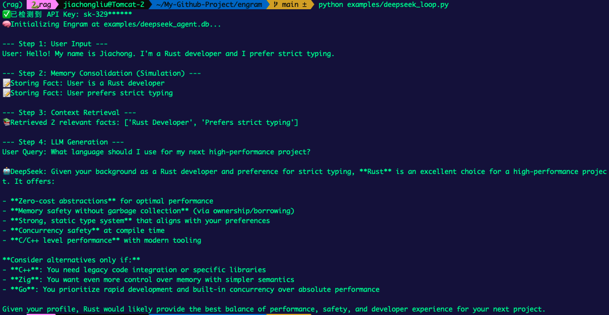
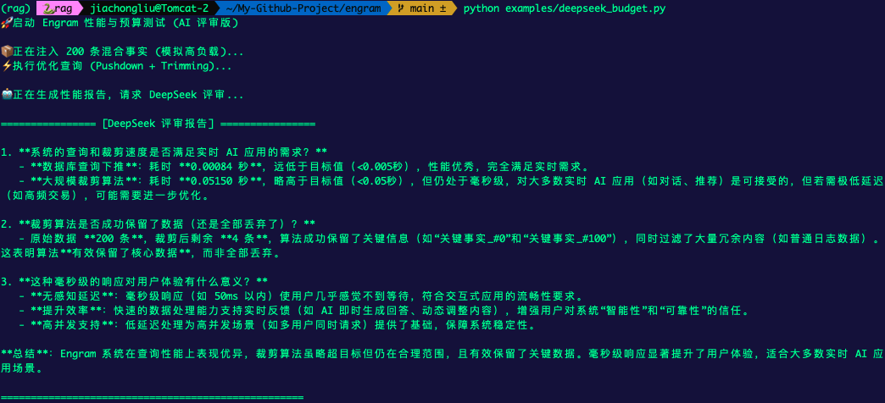
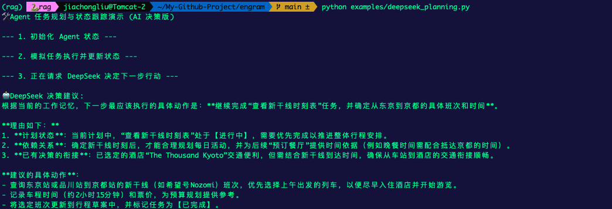
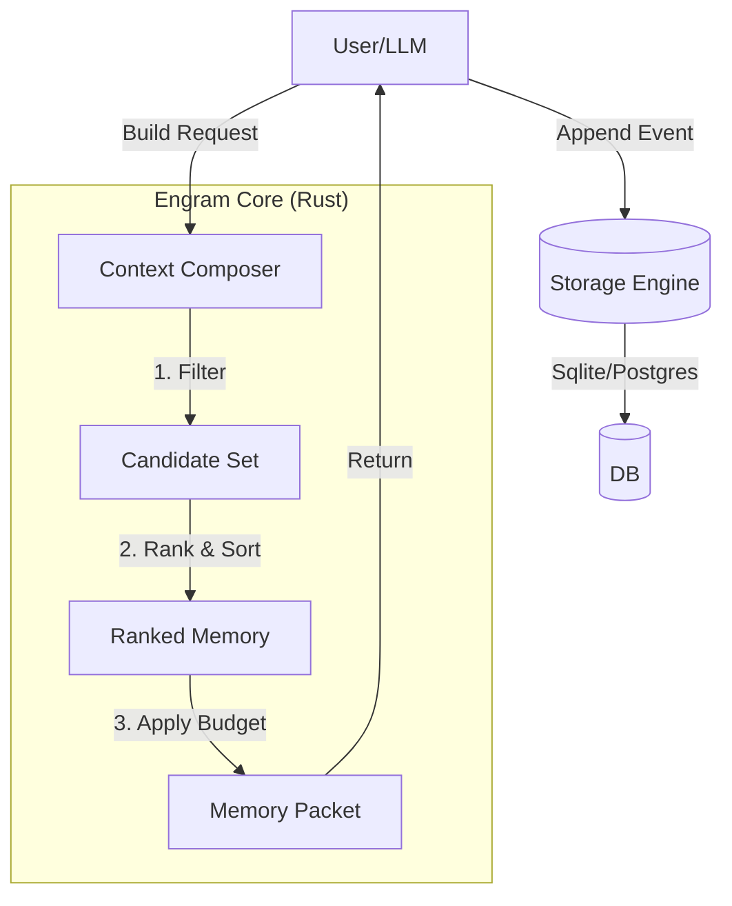

# 🧠 Engram

<div align="center">

**The High-Performance, Structured Memory System for AI Agents.**  
*Built in **Rust** 🦀 for speed, exposed to **Python** 🐍 for ease of use.*

[](https://www.rust-lang.org/)
[](https://www.python.org/)
[](LICENSE)
[](CONTRIBUTING.md)

</div>

---

**Engram** is not just a vector database. It is a **cognitive architecture** component designed to give Agents predictable, explainable, and latency-controlled memory. 

It implements a human-like memory hierarchy: **Working Memory** (short-term), **Episodic Memory** (experiences), and **Semantic Memory** (facts), all governed by strict recall policies and token budgets.

## ✨ Key Features

- **🚀 Blazing Fast**: Core logic written in Rust. Zero-copy data handling.
- **⚡ Async Native**: Fully non-blocking Python `AsyncMemory` for high-concurrency production apps (FastAPI, etc.).
- **🧠 Cognitive Hierarchy**: Native support for Working Memory, Episodic Events, and Semantic Facts.
- **🔍 Explainable Recall**: Don't just get chunks. Know *why* a memory was retrieved (Recency? Relevance? Importance?).
- **👮 Strict Budgeting**: Enforce hard token limits per section. Never blow your context window again.
- **🔌 Dual-Stack**: Use it seamlessly in **Rust** or **Python**.
- **💾 Pluggable Storage**: Zero-config **SQLite** (default), scalable to **Postgres** / **MySQL**.

---

## 🛠️ Installation

Build and install the Python extension (requires Rust toolchain):

```bash
cd python
maturin develop
# For Postgres/MySQL support:
# maturin develop --features mysql,postgres
```

---

## 🚀 Quick Start

Engram manages the lifecycle of your Agent's context.

### Synchronous (Simple)

```python
from engram import Memory

# 1. Initialize (In-Memory or File-based)
mem = Memory(in_memory=True)

# 2. Define Context Scope
scope = {
    "tenant_id": "demo",
    "user_id": "alice",
    "agent_id": "planner-bot",
    "session_id": "session-1",
    "run_id": "run-1"
}

# 3. Add a Fact (Long-term semantic memory)
mem.upsert_fact(scope, {
    "fact_id": "f1",
    "fact_key": "user_preference",
    "value": "Alice prefers concise answers.",
    "status": "active",
    "confidence": 1.0
})

# 4. Generate a Context Packet for the LLM
# This retrieves relevant facts, episodes, and working state based on the purpose.
packet = mem.build_memory_packet({
    "scope": scope, 
    "purpose": "responder",
    "budget": {"max_tokens": 2000}
})

print(f"Memory Packet Generated: {len(packet['long_term']['facts'])} facts included.")
```

---

## 💡 Advanced Usage

### Asynchronous Support (High Concurrency)

Ideal for web servers (FastAPI) or multi-agent orchestrators.

```python
import asyncio
from engram import AsyncMemory

async def main():
    mem = AsyncMemory(path="./agent.db")
    
    # Fire and forget concurrent writes
    await asyncio.gather(
        mem.append_event({"event_id": "e1", "kind": "message", "payload": "Hello", "scope": ...}),
        mem.append_event({"event_id": "e2", "kind": "tool_result", "payload": "Success", "scope": ...})
    )
    
    # Non-blocking read
    events = await mem.list_events(...)

asyncio.run(main())
```

### Observability & Tracing

Engram integrates Rust's `tracing` with Python's `logging`. See exactly how the "brain" works.

```python
import logging
# Enable DEBUG logs to see recall scoring and budget trimming decisions
logging.basicConfig(level=logging.INFO)
logging.getLogger("engram_store").setLevel(logging.DEBUG)
```

### Policies & Budgets

Control costs and context quality with deterministic rules.

```python
strict_policy = {
    "max_facts": 5,             # Only top 5 relevant facts
    "max_episodes": 2,          # Only last 2 relevant episodes
    "episode_time_window_days": 7
}

budget = {
    "max_tokens": 1000,         # Hard limit
    "per_section": {"facts": 200} # Specific limit for facts
}

packet = mem.build_memory_packet({
    "scope": ..., 
    "policy": strict_policy, 
    "budget": budget
})
```

See [examples/](examples/) for more demos, including **DeepSeek Integration**.

---

## 📚 Documentation & Resources

- **[DeepSeek Integration Guide](docs/engram_deepseek_guide.md)**: Build a stateful Agent with DeepSeek-V3.
- **[Architecture Deep Dive](docs/blog_architecture_deep_dive.md)**: Inside the Rust core, concurrency model, and memory hierarchy.
- **[Memory Packet V1 Spec](docs/MemoryPacket%20v1%20字段级规范表.md)**: Detailed JSON schema reference.

## 🖼️ Visual Demos

See Engram in action with DeepSeek-V3:

| **Cognitive Loop** | **Performance & Budgeting** |
| :---: | :---: |
|  |  |
| *Full cycle memory consolidation & recall* | *Pushdown limits & O(N) trimming verified* |

| **Task Planning** | **Integrated Recall** |
| :---: | :---: |
|  |  |
| *Working state tracking for agents* | *High-precision filtering under strict budget* |

## ⚡ Recent Optimizations (v0.2)

- **Concurrency**: Fixed SQLite startup locking using serialized WAL initialization.
- **Query Pushdown**: `LIMIT` clauses are now pushed to SQL for Facts and Procedures, reducing I/O.
- **O(N) Trimming**: Budget trimming algorithm optimized from quadratic to linear complexity.
- **Zero-Copy**: `WorkingState` and `StmState` are now passed by value to avoid cloning.

---

## 🏗️ Architecture



## 🔌 Integrations

- **LangChain**: `EngramChatMessageHistory`, `EngramContextInjector`
- **LangGraph**: `EngramCheckpointer`, `EngramNodeMiddleware`

## 🤝 Contributing

We welcome contributions! Please see [CONTRIBUTING.md](CONTRIBUTING.md) for details on how to set up the Rust + Python development environment.

## 📄 License

Apache License 2.0