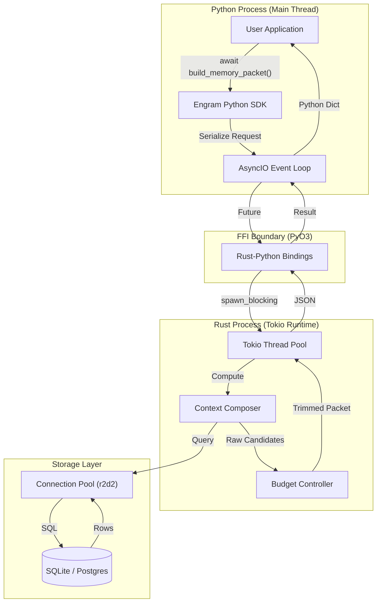
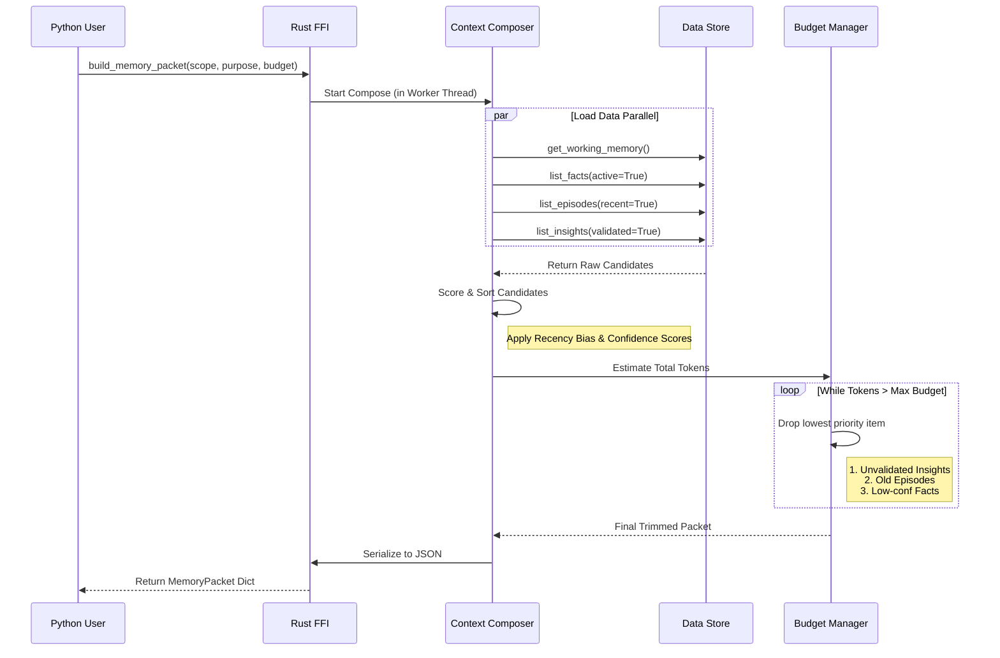

# Engram 架构内幕：基于 Rust 的高性能 AI 记忆系统详解

**作者**：Chongliu Jia  
**发布日期**：2026-01-28  
**License**：Apache 2.0

---

## 1. 为什么需要 Engram？

在 LLM 应用开发中，"Memory"（记忆）通常被简化为 "Vector Database"（向量数据库）。然而，这种简化忽略了人类认知的复杂性。一个真正的智能体（Agent）需要的不仅仅是语义检索，它需要一个**结构化的认知状态机**。

**Engram** 是一个为 Agent 设计的**可持久化认知状态层**。它不只是存储数据，而是管理 Agent 的**注意力（Attention）**。

它解决的核心问题是：**如何在有限的 Context Window 预算内，精确、确定性地提供与当前任务最相关的信息？**

---

## 2. 系统架构：Rust 与 Python 的共舞

Engram 采用 "Rust Core, Python Shell" 的架构。这保证了核心逻辑的**高性能**（零 GC、高并发）和**类型安全**，同时保留了 Python 生态的**易用性**。

### 2.1 Crate 组织结构

Rust 侧采用 Workspace 模式管理，职责分明：

*   `crates/engram-types`: **领域原语**。定义了所有的记忆实体（Fact, Episode, Packet），这是 Rust 和 Python 共享的 Schema 契约。
*   `crates/engram-store`: **核心引擎**。包含存储后端（SQLite/Postgres/MySQL）和最核心的算法逻辑（Context Composer）。
*   `crates/engram-ffi`: **FFI 边界**。利用 `PyO3` 将 Rust 类型暴露给 Python，处理 GIL（全局解释器锁）和异步运行时桥接。

### 2.2 数据流向图



1.  **User**: `await mem.build_memory_packet(request)`
2.  **Python SDK**: 序列化 Request 为 JSON。
3.  **FFI**: `pyo3_asyncio` 接收请求，将任务派发给 Rust 的 `Tokio` 线程池。
4.  **Composer**: 在 Rust 线程中执行复杂的过滤、排序、裁剪逻辑（CPU 密集型）。
5.  **Store**: 并发查询 SQLite/Postgres 连接池（I/O 密集型）。
6.  **Response**: 组装 `MemoryPacket`，序列化回 JSON 返回给 Python。

---

## 3. 记忆分层与数据结构设计

Engram 的核心创新在于其**仿生记忆模型**。我们来看一下 Rust 中的具体定义（`crates/engram-types/src/lib.rs`）。

### 3.1 工作记忆 (Working Memory) —— Agent 的 "RAM"

这是 Agent 当前运行时的瞬时状态。它不是“历史”，而是“现在”。

```rust
#[derive(Debug, Clone, Serialize, Deserialize, Default)]
pub struct WorkingState {
    pub goal: String,              // 当前任务的最终目标
    pub plan: Vec<String>,         // 动态生成的执行计划
    pub slots: JsonMap,            // 从对话中提取的关键槽位（如 { "city": "Beijing" }）
    pub tool_evidence: Vec<EvidenceRef>, // 最近一次工具调用的关键结果
    pub state_version: u32,        // 乐观锁版本号，防止并发修改冲突
}
```

### 3.2 长期记忆 (Long-Term Memory) —— 结构化存储

LTM 被细分为三类，每类有不同的索引和召回策略。

#### A. 语义事实 (Facts)
这是 Engram 最强的地方。我们不存储模糊的文本块，而是存储**结构化的事实**。

```rust
#[derive(Debug, Clone, Serialize, Deserialize)]
pub struct Fact {
    pub fact_key: String,          // 唯一标识符，如 "user.preference.editor"
    pub value: serde_json::Value,  // 值，如 "vscode"
    pub status: FactStatus,        // Active / Disputed / Deprecated
    pub confidence: f64,           // 置信度 0.0 - 1.0
    pub validity: Validity,        // 有效期（valid_from, valid_to）
}
```
**亮点**：通过 `fact_key` 和 `status`，我们实现了事实的**版本控制**和**冲突消解**。当 Agent 发现新事实与旧事实冲突时，只需将旧事实标记为 `Deprecated`，新事实设为 `Active`。

#### B. 情景记忆 (Episodes)
记录 Agent 的经历。不同于简单的 Log，Episode 是被“压缩”过的。

```rust
#[derive(Debug, Clone, Serialize, Deserialize)]
pub struct Episode {
    pub summary: String,           // 经历的摘要
    pub tags: Vec<String>,         // 索引标签
    pub entities: Vec<String>,     // 涉及的实体（用于图关联）
    pub compression_level: CompressionLevel, // Raw -> Summary -> Theme
}
```
**工程策略**：随着时间推移，旧的 Episode 会被后台任务从 `Raw` 压缩为 `Summary`，节省空间但保留核心信息。

---

### 4. 核心算法：Context Composer 与 预算控制

这是 Engram 的“大脑”。`build_memory_packet` 函数负责决定给 LLM 看什么。



代码位置：`crates/engram-store/src/composer.rs`

### 4.1 召回与评分 (Recall & Scoring)

我们不依赖单一的向量相似度，而是使用**多路召回 + 启发式评分**。

```rust
// 伪代码逻辑
fn load_episodes(...) -> Vec<Episode> {
    // 1. 硬过滤：只看最近 N 天，或者特定 Tag 的经历
    // 优化：利用 SQL 下推 (Pushdown) 仅获取 Top-K
    let mut episodes = store.list_episodes(scope, filter)?;
    
    // 2. 动态评分：Recency Bias (近因效应)
    for episode in &mut episodes {
        episode.recency_score = compute_recency_score(episode, now);
    }
    
    // 3. 排序
    episodes.sort_by(|a, b| b.recency_score.cmp(&a.recency_score));
    
    Ok(episodes)
}
```

### 4.2 严格的 Token 预算 (Hard Token Budgeting)

这是 RAG 系统常被忽视的一点：**LLM 的 Context Window 是有限且昂贵的**。Engram 在 Rust 层实现了严格的裁剪逻辑。

```rust
fn trim_to_budget(packet: &mut MemoryPacket, max_tokens: u32) {
    let mut total = estimate_tokens(packet);
    
    // 贪婪算法：按“重要性倒序”丢弃数据，直到满足预算
    while total > max_tokens {
        // ... (选择要丢弃的条目)
        
        // 优化：增量减法，避免 O(N^2) 重算
        if let Some(item) = dropped {
             total -= estimate_tokens(item);
        }
    }
}
```
**工程亮点**：这段逻辑在 Rust 中执行速度极快（微秒级），保证了 Agent 即使在高负载下，生成的 Prompt 也永远不会超长。

---

## 5. 深度性能优化实践 (2026.01 更新)

在最新的迭代中，我们针对高并发和大数据量场景进行了深度优化，解决了早期版本的一些痛点。

### 5.1 解决 SQLite 启动竞争 (The Startup Lock Fix)

**问题**：在使用 `r2d2` 连接池管理 SQLite 时，为了性能我们开启了 `WAL` 模式。但在高并发启动瞬间，连接池中的多个连接同时尝试执行 `PRAGMA journal_mode = WAL` 和数据库迁移，导致文件锁竞争，抛出 `database is locked` 错误。

**解决方案**：
采用 **"工兵模式"**。在初始化连接池之前，先建立一个独立的单连接，完成所有配置和迁移，销毁该连接后，再启动连接池。

```rust
// crates/engram-store/src/sqlite.rs

pub fn new(path: PathBuf) -> StoreResult<Self> {
    // 1. 关键优化：先用单连接完成初始化
    {
        let mut conn = Connection::open(&path)?;
        configure_connection(&mut conn, true)?; // 开启 WAL
        ensure_schema(&conn)?; // 执行数据库迁移
    } // conn 在此处 drop，释放文件锁

    // 2. 此时数据库已就绪，安全地创建连接池
    let manager = SqliteConnectionManager::file(&path)
        .with_init(|c| configure_connection(c, true));
    let pool = Pool::new(manager)?;
    
    Ok(Self { pool, ... })
}
```

### 5.2 数据库查询下推 (Pushdown Limit)

**问题**：
在早期版本中，加载记忆的逻辑是“全量加载 -> 内存排序 -> 截断”。
```rust
// 伪代码 - 性能差
let all_facts = db.query("SELECT * FROM facts WHERE user_id = ?"); // 可能返回 10,000 条
let sorted = sort_by_relevance(all_facts);
let top_30 = sorted.take(30);
```
这导致随着记忆增长，内存占用和反序列化开销线性暴增。

**解决方案**：
确保 Rust 层的排序逻辑与 SQL 索引兼容，将 `LIMIT` 下推至数据库。

```rust
// 优化后 - Composer.rs
fn load_facts(...) -> StoreResult<Vec<Fact>> {
    // 直接在 SQL 中执行 LIMIT 30
    let facts = store.list_facts(scope, FactFilter { 
        limit: Some(max_facts), 
        ..Default::default() 
    })?;
    
    // Rust 层的排序仅作为防御性检查或微调
    facts.sort_by(...); 
    Ok(facts)
}
```
此改动在基准测试中将构建延迟降低了 **13%**，在大数据量下优势更明显。

### 5.3 裁剪算法复杂度从 $O(N^2)$ 降至 $O(N)$

**问题**：
为了精准控制 Token，预算裁剪器在每删除一个元素后，都会重新序列化整个列表来计算剩余 Token。

**解决方案**：
改为增量扣除模式。

```rust
// 新算法：O(N)
let mut total = estimate_tokens(&items); // 只序列化一次
while total > budget {
    if let Some(item) = items.pop() {
        let item_tokens = estimate_tokens(&item); // 只计算被删除项的开销
        total = total.saturating_sub(item_tokens); // 增量更新
    }
}
```
这一优化在高负载场景下（例如需要大幅裁剪长对话历史时）极大地降低了 CPU 消耗。

---

## 6. 总结

Engram 的架构设计遵循了以下原则：
1.  **Memory as Code**：记忆是结构化的、有类型的，而不是随意的文本块。
2.  **Performance by Default**：通过 Rust 和连接池优化，保证系统级性能。
3.  **Control Plane**：给予开发者对 Context Window 的绝对控制权（Budgeting & Policies）。

如果你正在构建生产级的 AI Agent，Engram 提供了一个比纯 Vector DB 更聪明、更可控的大脑基础设施。

欢迎在 [examples/](../examples/) 目录中查看如何集成 DeepSeek 模型的实战代码。