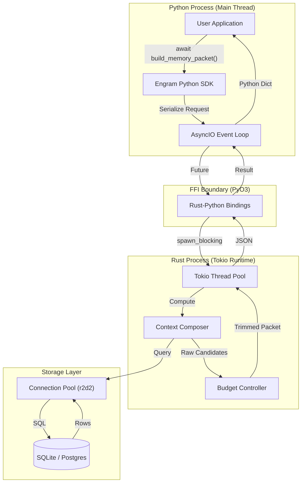
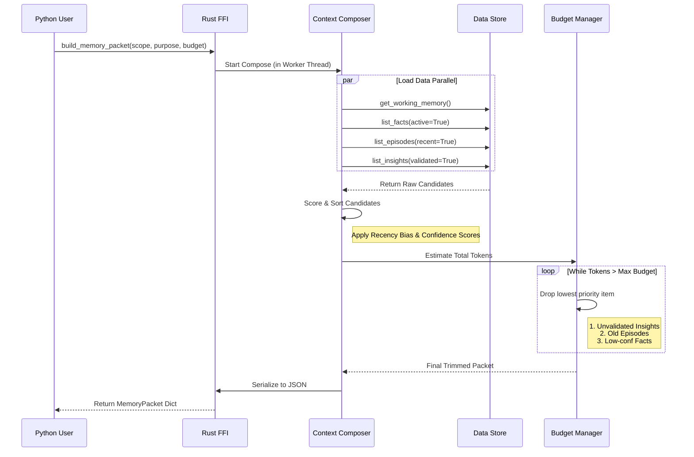

# Engram 架构内幕：基于 Rust 的高性能 AI 记忆系统详解

**作者**：Chongliu Jia  
**发布日期**：2026-01-16  
**License**：Apache 2.0

---

## 1. 为什么需要 Engram？

在 LLM 应用开发中，"Memory"（记忆）通常被简化为 "Vector Database"（向量数据库）。然而，这种简化忽略了人类认知的复杂性。一个真正的智能体（Agent）需要的不仅仅是语义检索，它需要一个**结构化的认知状态机**。

**Engram** 是一个为 Agent 设计的**可持久化认知状态层**。它不只是存储数据，而是管理 Agent 的**注意力（Attention）**。

它解决的核心问题是：**如何在有限的 Context Window 预算内，精确、确定性地提供与当前任务最相关的信息？**

---

## 2. 系统架构：Rust 与 Python 的共舞

Engram 采用 "Rust Core, Python Shell" 的架构。这保证了核心逻辑的**高性能**（零 GC、高并发）和**类型安全**，同时保留了 Python 生态的**易用性**。

### 2.1 Crate 组织结构

Rust 侧采用 Workspace 模式管理，职责分明：

*   `crates/engram-types`: **领域原语**。定义了所有的记忆实体（Fact, Episode, Packet），这是 Rust 和 Python 共享的 Schema 契约。
*   `crates/engram-store`: **核心引擎**。包含存储后端（SQLite/Postgres/MySQL）和最核心的算法逻辑（Context Composer）。
*   `crates/engram-ffi`: **FFI 边界**。利用 `PyO3` 将 Rust 类型暴露给 Python，处理 GIL（全局解释器锁）和异步运行时桥接。

### 2.2 数据流向图



1.  **User**: `await mem.build_memory_packet(request)`
2.  **Python SDK**: 序列化 Request 为 JSON。
3.  **FFI**: `pyo3_asyncio` 接收请求，将任务派发给 Rust 的 `Tokio` 线程池。
4.  **Composer**: 在 Rust 线程中执行复杂的过滤、排序、裁剪逻辑（CPU 密集型）。
5.  **Store**: 并发查询 SQLite/Postgres 连接池（I/O 密集型）。
6.  **Response**: 组装 `MemoryPacket`，序列化回 JSON 返回给 Python。

---

## 3. 记忆分层与数据结构设计

Engram 的核心创新在于其**仿生记忆模型**。我们来看一下 Rust 中的具体定义（`crates/engram-types/src/lib.rs`）。

### 3.1 工作记忆 (Working Memory) —— Agent 的 "RAM"

这是 Agent 当前运行时的瞬时状态。它不是“历史”，而是“现在”。

```rust
#[derive(Debug, Clone, Serialize, Deserialize, Default)]
pub struct WorkingState {
    pub goal: String,              // 当前任务的最终目标
    pub plan: Vec<String>,         // 动态生成的执行计划
    pub slots: JsonMap,            // 从对话中提取的关键槽位（如 { "city": "Beijing" }）
    pub tool_evidence: Vec<EvidenceRef>, // 最近一次工具调用的关键结果
    pub state_version: u32,        // 乐观锁版本号，防止并发修改冲突
}
```

### 3.2 长期记忆 (Long-Term Memory) —— 结构化存储

LTM 被细分为三类，每类有不同的索引和召回策略。

#### A. 语义事实 (Facts)
这是 Engram 最强的地方。我们不存储模糊的文本块，而是存储**结构化的事实**。

```rust
#[derive(Debug, Clone, Serialize, Deserialize)]
pub struct Fact {
    pub fact_key: String,          // 唯一标识符，如 "user.preference.editor"
    pub value: serde_json::Value,  // 值，如 "vscode"
    pub status: FactStatus,        // Active / Disputed / Deprecated
    pub confidence: f64,           // 置信度 0.0 - 1.0
    pub validity: Validity,        // 有效期（valid_from, valid_to）
}
```
**亮点**：通过 `fact_key` 和 `status`，我们实现了事实的**版本控制**和**冲突消解**。当 Agent 发现新事实与旧事实冲突时，只需将旧事实标记为 `Deprecated`，新事实设为 `Active`。

#### B. 情景记忆 (Episodes)
记录 Agent 的经历。不同于简单的 Log，Episode 是被“压缩”过的。

```rust
#[derive(Debug, Clone, Serialize, Deserialize)]
pub struct Episode {
    pub summary: String,           // 经历的摘要
    pub tags: Vec<String>,         // 索引标签
    pub entities: Vec<String>,     // 涉及的实体（用于图关联）
    pub compression_level: CompressionLevel, // Raw -> Summary -> Theme
}
```
**工程策略**：随着时间推移，旧的 Episode 会被后台任务从 `Raw` 压缩为 `Summary`，节省空间但保留核心信息。

---

### 4. 核心算法：Context Composer 与 预算控制

这是 Engram 的“大脑”。`build_memory_packet` 函数负责决定给 LLM 看什么。



代码位置：`crates/engram-store/src/composer.rs`

### 4.1 召回与评分 (Recall & Scoring)

我们不依赖单一的向量相似度，而是使用**多路召回 + 启发式评分**。

```rust
// 伪代码逻辑
fn load_episodes(...) -> Vec<Episode> {
    // 1. 硬过滤：只看最近 N 天，或者特定 Tag 的经历
    let mut episodes = store.list_episodes(scope, filter)?;
    
    // 2. 动态评分：Recency Bias (近因效应)
    for episode in &mut episodes {
        episode.recency_score = compute_recency_score(episode, now);
    }
    
    // 3. 排序
    episodes.sort_by(|a, b| b.recency_score.cmp(&a.recency_score));
    
    // 4. 初步截断 (Soft Limit)
    episodes.truncate(policy.max_episodes);
    
    Ok(episodes)
}
```

### 4.2 严格的 Token 预算 (Hard Token Budgeting)

这是 RAG 系统常被忽视的一点：**LLM 的 Context Window 是有限且昂贵的**。Engram 在 Rust 层实现了严格的裁剪逻辑。

```rust
fn trim_to_budget(packet: &mut MemoryPacket, max_tokens: u32) {
    let mut total = estimate_tokens(packet);
    
    // 贪婪算法：按“重要性倒序”丢弃数据，直到满足预算
    while total > max_tokens {
        let dropped = if drop_last_insight(&mut packet.insight) { true }
        else if drop_last_episode(&mut packet.long_term.episodes) { true } // 丢弃最老的经历
        else if drop_last_fact(&mut packet.long_term.facts) { true }       // 丢弃低置信度事实
        else { false };

        if !dropped { break; } // 无法再减了
        total = estimate_tokens(packet);
    }
}
```
**工程亮点**：这段逻辑在 Rust 中执行速度极快（微秒级），保证了 Agent 即使在高负载下，生成的 Prompt 也永远不会超长。

---

## 5. 工程亮点详解

### 5.1 Python 异步与 Rust 线程池的桥接

在 `crates/engram-ffi/src/lib.rs` 中，我们使用了 `pyo3-asyncio` 来桥接 Python 的 `asyncio` 和 Rust 的 `Tokio`。

```rust
fn async_build_memory_packet<'p>(&self, py: Python<'p>, request: String) -> PyResult<&'p PyAny> {
    let store = self.inner.clone(); // Arc<dyn Store> 线程安全引用计数
    
    // 将 Rust Future 转换为 Python Awaitable
    pyo3_asyncio::tokio::future_into_py(py, async move {
        // 使用 spawn_blocking 将计算密集型任务（Composer）移出事件循环
        // 这里的闭包是在 Rust 的线程池中运行的
        let json = tokio::task::spawn_blocking(move || {
            let packet = build_memory_packet(&*store, ...)?;
            serde_json::to_string(&packet)
        }).await??;
        
        Ok(json)
    })
}
```
**设计意图**：
*   **非阻塞**：Python 主线程（Event Loop）只负责派发任务，不会被 Rust 的计算或 I/O 阻塞。这使得 Engram 可以轻松集成到 FastAPI 等高并发 Web 服务中。
*   **Arc 指针**：`store` 被包裹在 `Arc` 中，多线程共享底层连接池，无需复制数据。

### 5.2 SQLite 连接池优化 (r2d2)

在早期的版本中，我们使用 `Mutex<Connection>`，这意味着所有数据库操作（包括读）都是串行的。在 `engram-store` 的最新迭代中，我们引入了 `r2d2` 连接池。

```rust
pub struct SqliteStore {
    // 线程安全的连接池，支持并发借出连接
    pool: Pool<SqliteConnectionManager>, 
}

impl SqliteStore {
    fn list_facts(&self, ...) -> StoreResult<Vec<Fact>> {
        // 从池中获取一个连接，不阻塞其他读请求
        let conn = self.pool.get()?; 
        // ... 执行查询
    }
}
```
**性能提升**：结合 SQLite 的 WAL (Write-Ahead Logging) 模式，这实现了**一写多读**的并发模型，大幅提升了 `build_memory_packet` 的吞吐量。

### 5.3 全链路可观测性 (Tracing)

为了调试复杂的 Agent 行为，我们在 Rust 核心植入了 `tracing`。

```rust
#[instrument(skip(store), fields(scope = ?request.scope))]
pub fn build_memory_packet(...) {
    debug!("Starting build pipeline...");
    // ...
    if total_tokens > budget {
        info!("Budget exceeded: {}, trimming...", total_tokens);
    }
}
```
通过 `pyo3-log`，这些 Rust 侧的结构化日志会直接流向 Python 的 `logging` 系统。Python 开发者只需 `logging.basicConfig(level=logging.DEBUG)` 就能看到底层的决策过程，无需学习 Rust 调试工具。

---

## 6. 总结

Engram 的架构设计遵循了以下原则：
1.  **Memory as Code**：记忆是结构化的、有类型的，而不是随意的文本块。
2.  **Performance by Default**：通过 Rust 和连接池优化，保证系统级性能。
3.  **Control Plane**：给予开发者对 Context Window 的绝对控制权（Budgeting & Policies）。

如果你正在构建生产级的 AI Agent，Engram 提供了一个比纯 Vector DB 更聪明、更可控的大脑基础设施。
